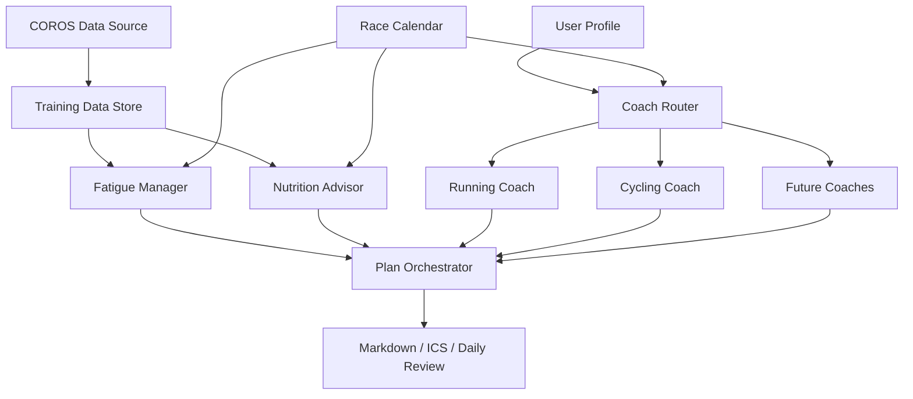

# Multi-Sport AI Coach

基于 COROS 数据的多项目 AI 教练系统原型。

目标用户是有一定训练基础、全年参加多个项目赛事的耐力运动爱好者，例如半程马拉松、公路车赛、越野跑、HYROX、全马等。系统会根据赛事日历动态启用对应教练模块，并结合恢复、训练负荷、营养与跨项目冲突检查，生成可执行训练计划。

## MVP Scope

- COROS 数据采集接口抽象：先定义数据模型，后续接入真实 COROS MCP。
- COROS MCP 文本 payload 适配器：把恢复状态、训练负荷、运动列表映射成内部稳定模型。
- COROS 连接状态机：把未配置、需要登录、已授权、授权过期、服务不可用统一成产品可展示状态。
- 数据同步策略：默认读取 90 天训练历史、42 天训练负荷、21 天健康趋势、7 天急性疲劳和未来 14 天日程。
- 用户画像与赛事日历：记录目标、限制、训练偏好和项目优先级。
- 用户训练可用性：记录每周训练总时长、每天可训练时长，以及是否接受一天两练。
- Coach Router：根据赛事类型动态启用跑步、自行车、越野跑、HYROX、游泳等模块。
- 疲劳管理：根据恢复、HRV、睡眠、负荷比给出训练量和强度预算。
- 最近训练识别：读取最近运动记录，把长距离越野跑、长骑等关键负荷纳入风险提示。
- 训练历史画像：基于 90 天活动计算完整窗口周均、活跃周周均、训练连续性、项目分布和最长训练。
- 周训练量决策：结合 90 天基线、训练连续性、疲劳预算和用户可用时间，生成可解释的周容量上限。
- 专项能力画像：越野跑追踪长距离、爬升和最长时间；自行车追踪骑行基础和功率数据可用性。
- 训练负荷估算：优先使用 COROS 官方负荷；缺失时用功率 TSS、心率/时长或时长模型降级估算。
- 数据导入报告：真实 COROS payload 运行时输出 bundle 状态、活动数量、详情增强数量、缺失数据和负荷来源。
- 营养模块：根据周期、训练类型和恢复状态给出补给建议。
- 项目教练模块：先实现跑步、自行车、越野跑原型，并把专项准备度传入教练决策；其他项目保留插件接口。
- 跨项目协调器：检查强度堆叠、恢复窗口和赛事优先级。
- 分项目训练量分配：根据赛事优先级和距离比赛时间给运动项目打分，在总量受限时优先保留当前主赛项目。
- 关键课保护：总量裁剪时优先保留长课、爬升课、tempo/threshold 等专项关键课，先压低维护课。
- 计划质量校验：检查结构化阶段、阶段时长合计、模糊执行范围和强度目标缺失，避免不可执行的日历训练。
- 训练复盘模型：比较计划训练和实际完成记录，输出完成比例、负荷差异和未来 24-48 小时调整建议。
- 本地 JSON 存储层：保存用户画像、赛事、训练计划和完成记录，为后续每日闭环与 UI 接入提供持久化基础。
- 输出层：输出 Markdown、JSON 和可导入日历应用的 ICS 周计划；后续扩展订阅 URL。

## Architecture



## Project Layout

```text
src/multisport_ai_coach/
  domain/          用户画像、赛事、训练、计划等核心模型
  data/            COROS 数据源接口与后续适配器
  analysis/        90 天训练历史画像、计划质量校验、训练复盘与后续能力分析
  fatigue/         疲劳管理与负荷预算
  nutrition/       周期营养、训练补给、比赛补给建议
  coaches/         跑步、自行车、越野跑、HYROX、游泳等教练模块
  orchestration/   Coach Router 与跨项目协调器
  output/          Markdown、ICS 等输出
```

See [`docs/trail-running-module.md`](docs/trail-running-module.md) for the first trail-running coach boundary and future reference-integration notes.
Trail and ultrarunning principles are summarized in [`docs/references/trail-running-principles.md`](docs/references/trail-running-principles.md).
Calendar export and subscription testing is documented in [`docs/calendar-subscription.md`](docs/calendar-subscription.md).

## Try the Prototype

```bash
PYTHONPATH=src python3 -m multisport_ai_coach.demo --weeks 1
```

当前 demo 使用内置样例数据：7 月 120km 越野跑 A 类赛事、10 月 90km 铁三接力自行车 B 类赛事、8-10 小时/周训练可用性、周六固定休息、FTP 194W、体重 70kg，以及最近越野跑比赛后的高负荷恢复状态。

常用命令：

```bash
PYTHONPATH=src python3 -m multisport_ai_coach.demo --weeks 1 --format markdown
PYTHONPATH=src python3 -m multisport_ai_coach.demo --weeks 1 --format json
PYTHONPATH=src python3 -m multisport_ai_coach.demo --weeks 1 --format both
PYTHONPATH=src python3 -m multisport_ai_coach.demo --weeks 1 --format ics > training-plan.ics
PYTHONPATH=src python3 -m multisport_ai_coach.demo --weeks 1 --format ics --output outputs/training-plan-demo.ics
```

`--format json` 是后续接入 Web UI 或自动化测试的结构化输出入口。`--format ics` 可以生成静态日历文件，用于 Apple Calendar、Google Calendar 等日历应用导入。

也可以用捕获到的 COROS MCP 文本 payload 跑真实数据原型：

```bash
PYTHONPATH=src python3 -m multisport_ai_coach.coros_live_demo \
  --bundle payloads/coros-2026-05-26 \
  --format markdown
```

`coros_live_demo --bundle` 默认会拒绝缺失或空 payload 文件；调试时可以加 `--allow-incomplete` 强制运行。
计划 notes 顶部会显示数据导入报告，用来判断本次计划是基于完整 COROS 数据、部分数据，还是保守降级数据。

创建标准 payload 目录：

```bash
PYTHONPATH=src python3 -m multisport_ai_coach.coros_payload_bundle init --bundle payloads/coros-2026-05-26
PYTHONPATH=src python3 -m multisport_ai_coach.coros_payload_bundle validate --bundle payloads/coros-2026-05-26
PYTHONPATH=src python3 -m multisport_ai_coach.coros_payload_bundle summary --bundle payloads/coros-2026-05-26
PYTHONPATH=src python3 -m multisport_ai_coach.coros_payload_bundle command --bundle payloads/coros-2026-05-26
```

当前数据层已经提供两个适配器：

- `InMemoryCorosDataSource`：demo 和单元测试使用的内存数据源。
- `CorosTextPayloadDataSource`：用于解析当前 COROS MCP 工具返回的文本 payload，例如恢复状态、训练负荷和运动记录列表。

连接体验层提供 `check_coros_connection` 和 `onboarding_steps`，用于把 COROS MCP 的底层状态转换成用户可理解的下一步动作。授权仍必须由用户本人完成，但产品侧可以把它包装成“一次连接、长期可用、失败降级”的流程。

默认数据同步窗口由 `DEFAULT_DATA_SYNC_POLICY` 管理：

```text
history_days = 90
load_days = 42
wellness_days = 21
acute_days = 7
schedule_days = 14
```
