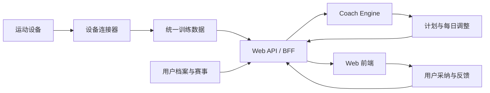

# TrainPilot Web 全栈规划 v2

日期：2026-07-10

## 1. 产品范围

TrainPilot 是面向跑步、骑行、游泳、铁三及多项目训练用户的 AI 多运动训练系统。系统读取已授权的运动设备数据，结合训练历史、恢复状态、赛事日历和个人时间安排，生成周期计划，并每天调整后续训练。

首个真实设备数据源为 COROS。产品界面和内部数据模型不与单一设备品牌绑定，后续可以接入 Garmin 等其他数据源。

产品只提供训练建议，不提供医疗诊断，不承诺比赛成绩。

## 2. 网站信息架构

### 公开转化层

- 落地页：产品定位、核心体验、工作方式、价格和服务边界。
- 登录注册：手机号、邮箱、微信等账号入口的前端界面。
- 价格与订阅：19.9 元/月、自动复盘和手动追问额度。

### 首次上手层

- 设备连接：展示支持状态、授权范围和同步状态。
- 运动方向：跑步、骑行、游泳、铁三或混合训练。
- 赛事与目标：A/B/C 赛事、日期、目标和优先级。
- 可训练时间：每周时长、每天时间窗、是否接受一天两练。
- 训练偏好：力量训练、交叉训练、长距离日、训练风格和伤病限制。
- 计划生成：展示数据检查、教练协同和计划质量检查过程。

### 训练工作台

- 今日：身体状态、今日建议、昨日复盘和未来 3 天调整。
- 周期计划：周历、训练阶段、单次训练详情和运动筛选。
- 训练复盘：完成质量、训练负荷、恢复趋势和历史记录。
- 赛事：A/B/C 赛事、倒计时和训练周期关联。
- 设备与数据：授权状态、最近同步时间、数据范围和取消授权。
- 账号与订阅：订阅状态、追问额度、导出与隐私设置。

## 3. 前后端职责

### 前端 `web`

- 负责路由、页面、表单、交互状态和响应式布局。
- 展示后端返回的身体状态、训练建议、计划和复盘结果。
- 触发设备授权、计划生成、每日复盘、教练追问和文件导出。
- 对用户输入做即时格式校验，但不判断训练是否合理。
- 不直接调用 COROS MCP，不保存设备 token，不在浏览器中实现训练算法。

### Web API / BFF

- 负责登录会话、订阅权限和每月追问额度。
- 发起并保存设备 OAuth 授权，调度每日一次数据同步。
- 将不同设备数据转换为统一的运动与恢复数据模型。
- 组合用户档案、赛事、时间安排和设备数据，调用训练引擎。
- 保存计划版本、每日复盘和用户对建议的采纳结果。
- 输出 CSV、图片任务和带私密 token 的 ICS 日历订阅。

### Python `services/coach-engine`

- 负责训练负荷、疲劳、恢复和运动能力分析。
- 跑步、骑行、游泳等教练模块生成候选训练。
- 多运动协调器处理强度冲突、长课冲突和恢复约束。
- 计划质量门检查训练结构、区间、时长和降级规则是否完整。
- 返回结构化 JSON，不负责网页、账号、支付或 OAuth。

## 4. 推荐接口

```text
POST /api/v1/auth/login
GET  /api/v1/me

GET  /api/v1/devices
POST /api/v1/devices/coros/authorize
POST /api/v1/devices/coros/callback
POST /api/v1/devices/:id/sync
DELETE /api/v1/devices/:id

GET  /api/v1/profile
PUT  /api/v1/profile
GET  /api/v1/events
POST /api/v1/events
PUT  /api/v1/events/:id

POST /api/v1/plans/generate
GET  /api/v1/plans/current
GET  /api/v1/plans/:id/weeks/:week
POST /api/v1/plans/:id/adjust

GET  /api/v1/dashboard/today
POST /api/v1/reviews/daily
GET  /api/v1/reviews
POST /api/v1/coach/messages

GET  /api/v1/exports/plan.csv
GET  /api/v1/exports/plan.png
GET  /api/v1/calendar.ics?token=<private-token>
```

## 5. 核心数据流



## 6. V1 前端交付范围

- 可直接打开和导航的完整前端体验。
- 落地页、登录、设备连接、首次问卷、计划生成、今日、计划、复盘、赛事和设备页。
- 模拟数据驱动，所有页面共享统一数据结构。
- 训练计划 CSV、ICS 和图片导出继续可用。
- API 边界独立，后端可逐个替换模拟数据，不需要重写页面。

## 7. 后端接入顺序

1. 建立 BFF 和统一响应格式。
2. 接入账号、用户档案和赛事 CRUD。
3. 包装 COROS 授权与同步。
4. 将 `coach-engine` 暴露为生成计划和每日复盘接口。
5. 接入持久化、订阅、定时任务和通知。
6. 增加其他设备连接器，不改变前端页面模型。
